# JSP-Fundamentals


## What is a JSP file?
+ JSP file is an HTML page with some Java code sprinkled in .. 
+ It gives, include dynamic content from Java code

      <HTML code> Java code </HTML code>
     
## Where is the JSP procesed?
+ JSP is processd on the server
+ Results of Java code included in HTML returned to browser   
     

## Where to place JSP file?
+ The JSP file goes in your **WebContent** folder
+ Must jave **.JSP** extension


## Code example 
helloworld.jsp
```JSP
<%--
  Created by IntelliJ IDEA.
  User: tilme
  Date: 26/07/2022
  Time: 13:26
  To change this template use File | Settings | File Templates.
--%>
<%@ page contentType="text/html;charset=UTF-8" language="java" %>
<html>
<head>
    <title>Title</title>
</head>
<body>
<h3>Hello World of Java!</h3>

The time on the server is <%=new java.util.Date()%>

</body>
</html>
``` 
We have body in HTML coe `<h3>Hello World of Java!</h3>`  and `The time on the server is` and the only java code is ` <%=new java.util.Date()%>`, So, with JSP we make use of angle bracket persent and inside it can put JSP element `<% %> `, in our example we use what we call a JSP experssion, for that we use `=` symbol. Here we create new Data object,This will give us the current time stamp and than include the output of the state object in the page, so in effect, it will call toString method on the state object and include the result of that in this page that goes back to the browser.

## Scripting Elements

There are three types of scripting elements: 
+ JSP expressions
+ JSP scriptlets
+ JSP declarations.

|Element|Syntax|
| ------- | ------- |
| **JSP Expression** | <%= some Jave Expression %> |
| **JSP Scriptlet** | <% some java code: 1 to many lines %> |
| **JSP Declaration** | <%! varibale or method declaration %> |


### JSP Expressions 

+ Compute an expression 
+ Result is included in HTML returned to browser
**Syntax**
`<%= some Jave Expression %>`

#### **JSP Expression - Examples**

JSP file   
`The time on the server is  <%=new java.util.Date()%>`    
&emsp;&emsp;&emsp;&emsp;&emsp;&emsp;&emsp;&emsp;&emsp;&emsp;&emsp;\   
 &emsp; Generated HTML  &emsp;&emsp;   \    
 &emsp;&emsp;&emsp;  `The time on the server is Wed Jul 27 14:11:29 CEST 2022`    
 
**expresion-test.jsp**
```JSP
<%--
  Created by IntelliJ IDEA.
  User: tilme
  Date: 26/07/2022
  Time: 14:08
  To change this template use File | Settings | File Templates.
--%>
<%@ page contentType="text/html;charset=UTF-8" language="java" %>
<html>
<head>
    <title>Expressions Test</title>
</head>
<body>

Converting a string to uppercase: <%=new String("Hello World".toUpperCase())%>

<br/><br/>

25 multiplied by 4 equal <%= 25*4%>

<br/><br/>

Is 75 less than 69 ? <%= 75 < 69 %>


</body>

</html>
```


### JSP Scriptlets

A scriptlet is a JSP constrcut.
+ It allows to add/insert 1 to many lines of java code
+ To include content in page use:**out.println(...)**

**Syntax**
```JSP
<%
  // some lines of jave code
%>
```

> That code will be executed top down when the page is processed.

#### Code Example

```JSP
<h3>Hello World of Java</h3>

<%
  for (int i = 1; i <= 5; i++){
    ot.println("<br/>I really love to code: " + i);
  }
%>
```

Hello World of Java and than we add a scriplets. Here insted of **system.out.println()**, we use **out.println()**, so this will be included in the html page that's return.

scriptlet-test.jsp
```JSP
<%--
  Created by IntelliJ IDEA.
  User: tilme
  Date: 26/07/2022
  Time: 14:22
  To change this template use File | Settings | File Templates.
--%>
<%@ page contentType="text/html;charset=UTF-8" language="java" %>
<html>
<head>
    <title>Scriptlet Test</title>
</head>
<body>

<h3>Hello World of Java</h3>
<%
  for (int i = 1; i <= 5; i++) {
    out.println("<br/>I really love to code : " + i);
  }
%>
</body>
</html>
```


#### JSP Scriptlet - Best Practice
+ Minimize the amount if scriptlet code in JSP 
+ Avoid dumping thousands of lines of code in a JSP
+ Refactor into a seprate Java class ... make use of MVC

### JSP Declarations
A JSP declaration is used to declare variables and methods in a page's scripting language.
+ Declare a method in the JSP page
+ Call the method in the same JSP page 

**Syntax**
```JSP
<%!
  // declare a method
%>
```

> The syntax is basically an angle bracket, percent,with an exclamation point, and then you declare your method like any normal Java method.

#### Code Example
```JSP
<%!
  String makeItLower(String data){
    return data.toLowerCase();
  }
%>

Lower case "Hello World": <%= makeItLower("Hello World") %>
```
Uptop, declare a method using a declaration syntax. just like a normal Java method declaration. Have a return type of string, the name of the method, makeItLower, any input parameters, in this case we have string data, and then internally inside the body  you write your actual implementation code.

At the bottom we make use of that method, b using JSP expression.

```JSP 
<%--
  Created by IntelliJ IDEA.
  User: tilme
  Date: 26/07/2022
  Time: 22:39
  To change this template use File | Settings | File Templates.
--%>
<%@ page contentType="text/html;charset=UTF-8" language="java" %>
<html>
<head>
    <title>Declaration Test</title>
</head>
<body>

<%!
  String makeItLower(String data) {
    return data.toLowerCase();
  }
%>

Lower case "Hello World": <%=makeItLower("Hello World")%>

</body>
</html>
```


#### JSP Declaration - Best Practice
+ Minimize the number of declarations in a JSP
+ Aviod dumping thousand of lines of code in a JSP
+ Refactor this into a separate Java class ... make use of MVC

## Call Java Class from JSP

**FunUtils.java**
```JAVA
package com.tilmeez.jspdemo;

public class FunUtils {

    public static String makeItLower(String data) {
        return data.toLowerCase();
    }
}
```


**fun-test.jsp**
```JSP
<%--
  Created by IntelliJ IDEA.
  User: tilme
  Date: 27/07/2022
  Time: 00:23
  To change this template use File | Settings | File Templates.
--%>
<%@ page contentType="text/html;charset=UTF-8" language="java" import="com.tilmeez.jspdemo.*" %>
<html>
<head>
    <title>Fun Test</title>
</head>
<body>

Let's have some fun: <%= FunUtils.makeItLower("FUN FUN FUN")%>

</body>
</html>
```

In **fun-test.jsp** in oder to call method'S define in **funUtils** class we use JSP expression but for that we need to give fully qualified class name `com.tilmeez.jspdemo.FunUtils.makeItLower(...)`   which includes **package name**, **Class name**, and **method name**. Also can used clean way by using import statement for that, in JSP file at top `<%@ page import="com.tilmeez.jspdemo.*" %>` with import we can clean up th JSP expression like ` <%= FunUtils.makeItLower("FUN FUN FUN")%>` we can also use **,** to import more package as required like `<%@ page import="com.tilmeez.jspdemo.*, java.util.ArrayList" %>`


## JSP Built-In Objects
+ Given to you for free
+ Use  them directly in your JSP page  
    
<br/>

+ List of commonly used JSP objects

| Objects         | Description                                         |
| --------------- | --------------------------------------------------- |
| **request**     | Contains HTTP request header and form data          |
| **response**    | Provides HTTP support for sending response          |
| **out**         | JspWriter for including content in HTML page        |
| **session**     | Unique session for each user of the web application |
| **application** | Shared data for all users of the web application    |


The browser communicating with JSP. Behind the scenes, the HTTP protocol, they actually send over a request object. This request object contains header information and body information. The JSP can perform some work on that information and then send back a response. So, we have the whole request/response protocol going.

### Code Example:

**builtin-test.jsp**

```JSP
<%--
  Created by IntelliJ IDEA.
  User: tilme
  Date: 27/07/2022
  Time: 00:29
  To change this template use File | Settings | File Templates.
--%>
<%@ page contentType="text/html;charset=UTF-8" language="java" %>
<html>
<head>
    <title>JSP Built-In Objects</title>
</head>
<body>
<h3>JSP Built-In Objects</h3>

Request user agent: <%=request.getHeader("User-Agent")%>

<br/><br/>

Request language: <%=request.getLocale()%>

</body>
</html>
```

In order to find what kind of browser is user using, we can access this information useing the `**request object**` e.g. `request.getheader` and than header name of User-Agent ` <%=request.getHeader("User-Agent")%>` this will get the actual browser that the client is using also the the operating system information.To get language used by user `<%=request.getLocale()%>`


##  Including Files in JSP

Common use case of including files is including standard headers and footers. For example When building website need to display header and footer information on every page for this simply create header and footer in separate file and include in JSP files.

```mermaid
graph LR
   
    JSP-->my-header.html
    JSP-->my-footer.jsp
 ``` 
 
 **my-header.html**
```html
<h1 align="center">JSP Tutorial</h1>
``` 
**my-footer.jsp**
```JSP
<p align="center">
  Last updated: <%=new java.util.Date()%>
</p>
```

**homepage.jsp**
```JSP
<%--
  Created by IntelliJ IDEA.
  User: tilme
  Date: 27/07/2022
  Time: 00:50
  To change this template use File | Settings | File Templates.
--%>
<%@ page contentType="text/html;charset=UTF-8" language="java" %>
<html>
<head>
    <title>Title</title>
</head>
<body>
<jsp:include page="my-header.html"/>

Blah blah blah .... <br/><br/>
Blah blah blah .... <br/><br/>
Blah blah blah .... <br/><br/>
Blah blah blah .... <br/><br/>

<jsp:include page="my-footer.jsp"/>

</body>
</html>
```


# HTML Forms Overview

## Step 1: Build HTML Form


```HTML
<form action="student-response.jsp">
  
  First Name: <input type="text" name="firstName" />
  
  Last Name: <input type="text" name="lastName" />
  
  <input type="submit" value="Submit" />
  
</form>
```

+ Start with form tag than specify action ( where to send specify data)`action="student-response.jsp`
+ Next set-up our text field, `intput type="text"` than give `name="firstName"` which will be use on server side
+ Next we have submit button,`input type="submit"` and `value="Submit"` value portion is for label.
+ When submit button is hit, the data will be send to JSP page to process.

## Step 2: Reading Form data with JSP
**HTML FILE**
```HTML 
First Name: <input type="text" name="firstName" />
  
Last Name: <input type="text" name="lastName" />
```

&emsp;&emsp;&emsp;**JSP FILE**
```JSP
          The student is confirmed:
          <%= request.getParameter("firstName") %> <%= request.getParameter("lastName") %>
          ```

+ In JSP file, data is read by `request.getParameter("firstName")`
+ Alternate syntax: `${param.formFieldName}

```JAP
The student is confirmed: ${param.firstName} ${param.lastName}
```
>**NOTE**   
>Short cut method: Only use for display form data, if needed to read the data in maybe a scriptlet or something than have to resort back to `request.getParameter`.

**studetn-form.html**
```HTML
<!DOCTYPE html>
<html lang="en">
<head>
    <meta charset="UTF-8">
    <title>Student Registration Form</title>
</head>
<body>

<form action="student-form.jsp">

    First Name: <input type="text" name="firstName"/>

    <br/><br/>

    Last Name: <input type="text" name="lastName"/>

    <br/><br/>

    <input type="submit" value="Submit"/>

</form>

</body>
</html>
```

**student-form.jsp**
```JSP
<html>

<head>
    <title>Student Confirmation Title</title>
</head>

<body>

    The student is confirmed: ${param.firstName} ${param.lastName}
</body>
</html>
```
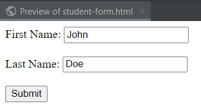

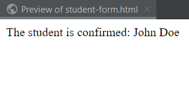

## Drop-Down list

**Drop-Down List - HTML `<select>` Tag**

```HTML
<select name="country">
  <option>Brazil</option>
  <option>France</option>
  <option>Germany</option>
  <option>India</option>
  <option>Pakistan</option>
</select>
```

<select name="country">
  <option>Brazil</option>
  <option>France</option>
  <option>Germany</option>
  <option>India</option>
  <option>Pakistan</option>
</select>


+ To make drop-down list in HTML, `<select>` tag is used .
+ To put options is drop-down list, `<option>` tag is used inside  `<select>` tag.
+ `select name="country"` thats the name of form field that will be used in JSP page to read from data.

**student-dropdown-from.html**
```HTML
<!DOCTYPE html>
<html lang="en">
<head>
    <meta charset="UTF-8">
    <title>Student Registration Form</title>
</head>
<body>

<form action="student-dropdown-response.jsp">

    First Name: <input type="text" name="firstName"/>

    <br/><br/>

    Last Name: <input type="text" name="lastName"/>

    <br/><br/>

    <select name="country">
        <option>Brazil</option>
        <option>France</option>
        <option>Germany</option>
        <option>India</option>
        <option>Pakistan</option>
    </select>

    <br/><br/>

    <input type="submit" value="Submit"/>

</form>

</body>
</html>
```
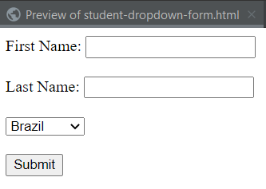   

**student-dropdown-response.jsp**
```JSP
<html>

<head>
    <title>Student Confirmation Title</title>
</head>

<body>

The student is confirmed: ${param.firstName} ${param.lastName}

<br/><br/>

The student's country: ${param.country}

</body>
</html>
```
        
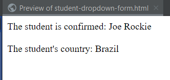

## Radio Button
**HTML for Radio Button**
```HTML
<input type="radio" name="favoriteLanguage" value="Java"> Java
<input type="radio" name="favoriteLanguage" value="C#"> C#
<input type="radio" name="favoriteLanguage" value="PHP"> PHP
<input type="radio" name="favoriteLanguage" value="Ruby"> Ruby
```

<input type="radio" name="favoriteLanguage" value="Java"> Java
<input type="radio" name="favoriteLanguage" value="C#"> C#
<input type="radio" name="favoriteLanguage" value="PHP"> PHP
<input type="radio" name="favoriteLanguage" value="Ruby"> Ruby


+ The `<input>` tag specifies an input field where the user can enter data.
+ The `<input>` element is the most important form element.
+ The `<input>` element can be displayed in several ways, depending on the type attribute.
    * `<input type="button">`
    * `<input type="checkbox">`
    * `<input type="color">`
    * `<input type="date">`
    * `<input type="datetime-local">`
    * `<input type="email">`
    * `<input type="file">`
    * `<input type="hidden">`
    * `<input type="image">`
    * `<input type="month">`
    * `<input type="number">`
    * `<input type="password">`
    * `<input type="radio">`
+ The type attribute specifies the type of `<input>` element to display.
+ If the type attribute is not specified, the default type is "text".


**student-radio-form.html**
```HTML
<!DOCTYPE html>
<html lang="en">
<head>
    <meta charset="UTF-8">
    <title>Student Registration Form</title>
</head>
<body>

<form action="student-radio-response.jsp">

    First Name: <input type="text" name="firstName"/>

    <br/><br/>

    Last Name: <input type="text" name="lastName"/>

    <br/><br/>

    <input type="radio" name="favoriteLanguage" value="Java"> Java
    <input type="radio" name="favoriteLanguage" value="C#"> C#
    <input type="radio" name="favoriteLanguage" value="PHP"> PHP
    <input type="radio" name="favoriteLanguage" value="Ruby"> Ruby

    <br/><br/>

    <input type="submit" value="Submit"/>

</form>

</body>
</html>
```

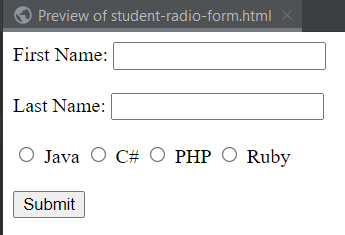

**student-radio-response.jsp**
```JSP
<html>

<head>
    <title>Student Confirmation Title</title>
</head>

<body>

The student is confirmed: ${param.firstName} ${param.lastName}

<br/><br/>

The student's programming Language: ${param.favoriteLanguage}
</body>
</html>
```

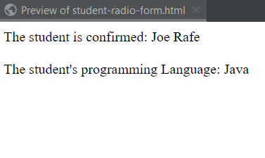

## Checkboxes

**HTML \<input type="checkbox">**
+ The `<input type="checkbox">` defines a checkbox.
+ The checkbox is shown as a square box that is ticked (checked) when activated.
+ Checkboxes are used to let a user select one or more options of a limited number of choices.

> **Tip:** Always add the `<label>` tag for best accessibility practices!

```HTML
<input type="checkbox" name="favotireLanguage" value="Java"> Java
<input type="checkbox" name="favotireLanguage" value="C#"> C#
<input type="checkbox" name="favotireLanguage" value="PHP"> PHP
<input type="checkbox" name="favotireLanguage" value="Ruby"> Ruby
```
<form>
<input type="checkbox" name="favotireLanguage" value="Java"> Java
<input type="checkbox" name="favotireLanguage" value="C#"> C#
<input type="checkbox" name="favotireLanguage" value="PHP"> PHP
<input type="checkbox" name="favotireLanguage" value="Ruby"> Ruby
</form>


**student-checkbox-form.html**
```HTML
<!DOCTYPE html>
<html lang="en">
<head>
    <meta charset="UTF-8">
    <title>Student Registration Form</title>
</head>
<body>

<form action="student-checkbox-response.jsp">

    First Name: <input type="text" name="firstName"/>

    <br/><br/>

    Last Name: <input type="text" name="lastName"/>

    <br/><br/>

    <input type="checkbox" name="favoriteLanguage" value="Java"> Java
    <input type="checkbox" name="favoriteLanguage" value="C#"> C#
    <input type="checkbox" name="favoriteLanguage" value="PHP"> PHP
    <input type="checkbox" name="favoriteLanguage" value="Ruby"> Ruby
    
    <br/><br/>

    <input type="submit" value="Submit"/>

</form>

</body>
</html>
```
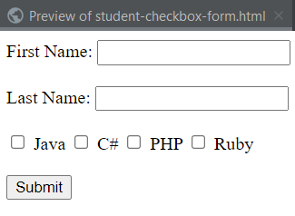


**student-checkbox-response.jsp**
```JSP
<html>

<head>
    <title>Student Confirmation Title</title>
</head>

<body>

The student is confirmed: ${param.firstName} ${param.lastName}
  Favorite Programming Languages: <br/>
<br/><br/>
<!-- display list of "favorite language" -->
<ul>
    <%
        String[] langs = request.getParameterValues("favoriteLanguage");

         if (langs != null) {
            for (String tempLang : langs) {
                out.println("<li>" + tempLang + "</li>");
            }
        }
    %>
</ul>
</body>
</html>
```

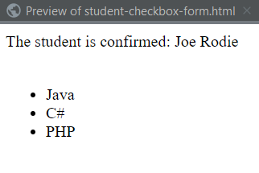

## Tracking user actions with Sessions
+ JSP session is created once for user's browser session. Unique for this user.
+ Commonly used when you need to keep track of the user's actions.

**For Example**
+ Shopping cart
+ Online Banking
+ Online Exam

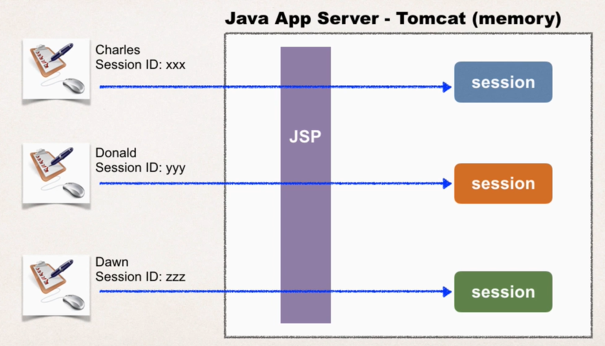

**Add data to session object**

<ins>_Method signature_</ins>
  ```JAVA
session.setAttribute(String name, Object value)
```
+ make use of the built-in session object `session.setAttribute`.
+ String name is a label.
+ Object value is a object that is gonna placed in session.

<ins>_Code example_</ins>
```Java
List<String> items = new ArrayList<>();
session.setAttribute("myToDoList", items);
```

**Retrieve data from session object**
<ins>_Method signature_</ins>
```JAVA
Object session.getAttribute(String name)
```
+ To retrieve data, the method signature is `session.getAttribute`.
+ String name is the name of the item that is retrieving, it will return a plain object.

<ins>_Code example_</ins>
```JAVA
List<String> myStuff = (List<String>) session.getAttribute("myToDOList");
```

>`(List<String>)` is Downcast the object to appropriate type

### JSP Session - Other useful methods

| Method                                    | Description                                                                      |
| ----------------------------------------- | -------------------------------------------------------------------------------- |
| isNew() : boolean                         | Return true if the session is new                                                |
| getId() : String                          | Returns the session id                                                           |
| invalidate() : void                       | Invalidates this session and unbinds any object associated with it               |
| setMaxInactiveInterval(long mills) : void | Set the idle time for a session to expire. The value is supplied in milliseconds |

**todo-demo.jsp**
```HTML
<%@ page import="java.util.*" contentType="text/html;charset=UTF-8" language="java" %>
<html>
<head>
    <title>Title</title>
</head>
<body>
<!-- Step 1: Create HTML form -->
<form action="todo-demo.jsp">

    Add new item: <input type="text" name="theItem" />

    <input type="submit" value="Submit" />
</form>

<br>


<!-- Step 2: Add new item to "To Do list -->
<%
    // get the TO Do items from the session
    List<String> items = (List<String>) session.getAttribute("myToDoList");

    // if the To Do items doesn't exist, then create a new one
    if (items == null) {
        items = new ArrayList<String>();
        session.setAttribute("myToDoList", items);
    }

    // see if there is form data to add
    String theItem = request.getParameter("theItem");

    //
    // Code BLOCK for boolean and if/then statement
    //
    boolean isItemNotEmpty = theItem != null && theItem.trim().length() > 0;
    boolean isItemNotDuplicate = theItem != null && !items.contains(theItem.trim());

    if (isItemNotEmpty && isItemNotDuplicate) {
    items.add(theItem);
    }
%>

<!-- Step 3: Display all "To Do" item from session -->
<hr>
<b>To List Items:</b> <br/>

<ol>
    <%
        for (String temp : items) {
            out.println("<li>" + temp + "</li>");
        }
    %>
</ol>

</body>
</html>
</body>
```
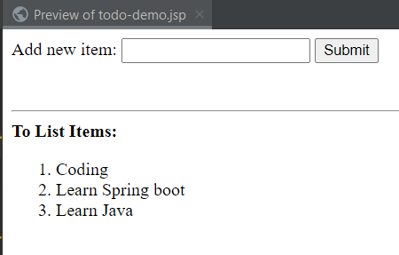

Now let's explain each section in detail

` <%@ page import="java.util.*" %>  `

This code performs an import of the package java.util. We make use of the List and ArrayList from this package.

\--

```HTML
    <html> 
    <body>
```

basic HTML set up code

\---

**\<!-- Step 1: Create HTML form -->**


```HTML
    <form action="todo-demo.jsp">
          Add new item: <input type="text" name="theItem" />    
    
          <input type="submit" value="Submit" />   
    </form>
```

This code creates an HTML form. The action will point back to the same JSP. So effectively, we are submitting form data back to ourselves. This form will read a text input from the user. The field is named "theItem". We'll read this field later to add it to your list. The form also includes a submit button.

\---

This is a big section, so let's break down in detail even further.

At a high-level, we are going to add a new item to our to do list.

The high-level steps include

1\. Get the TO DO items from the session

2\. If the TO DO items doesn't exist in the session, then create a new list and add it to the session

3\. Check to see if there is any form data to add.

Okay, let's break it down in detail with code examples.

\----

**\<!-- Step 2: Add new item to "To Do" list -->**


```JAVA
    <%     
          // get the TO DO items from the session    
          List<String> items = (List<String>) 
          session.getAttribute("myToDoList");
```

This section of code access the JSP session object. The session object is unique for each web user. We attempt to get the TO DO items from the session. We make use of the attribute name "myToDoList". This is basically the key/label to look up data from the session.

The session.getAttribute method will always return something of type java.lang.Object. We downcast this to List\<String> because we are making use of strings to keep track of our to do items.

This is assigned to the variable "items". This variable holds an object reference to the data that we retrieved from the session object. We can use this variable later in the program to add items and also display items.

\----

**// if the TO DO items doesn't exist, then create a new one**


```
        if (items == null) {
              items = new ArrayList<String>();
              session.setAttribute("myToDoList", items);        }
```

This section of code checks to see if the TO DO items doesn't exist. If checks the variable "items" to see if it is null. If "items" is null then that means the TO DO items do not exist. Think of this as like a shopping cart .... your cart doesn't exist.

As a result, we need to create a new list and assign to items.

Then we place the items in the session. We make use of the name, value pair.  The attribute name is "myToDoList" and the object is the "items" variable.

\---

  
**// see if there is form data to add**


```JAVA
        String theItem = request.getParameter("theItem");
        if (theItem != null && (!theItem.trim().equals(""))) {
        items.add(theItem);
        }
       %>
```

This section of code checks to see if there is form data to add. It reads the form data with the request.getParameter("theItem").  This is assigned to a variable. If the theItem variable is not null, then that means the user entered some data. Then we add theItem to our "items" array list.

Since we're using object references, remember that "items" is a variable that holds a reference to an object. Then it points to the same area of memory that is used by the session. So in effect, the users's session has now been updated with this new entry.

\---

**\<!-- Step 3: Display all "To Do" item from session -->**

```HTML
    <hr> 
    <b>To List Items:</b> <br/>
    <ol>
    <%   
    for (String temp : items) { 
          out.println("<li>" + temp + "</li>");    
          } 
    %>    
    </ol>
```

This section of code displays all of the "To Do" items from the session.

We make use of our variable "items" because it is our object reference to the data.

We use the "items" variable in the for loop to display the contents of each string in our array list.

To display data, we make use of "out.println".

\---

```HTML
    </body> 
    </html>
```

This code just wraps up the HTML page.


### FAQ: Details on PageContext and Session objects

**PageContext**

****


**>> Please define clearly what pageContext is and what it does.**

A PageContext instance provides access to all the namespaces associated with a JSP page, provides access to several page attributes, as well as a layer above the implementation details. Implicit objects are added to the pageContext automatically.

The PageContext provides a number of facilities to the developer, including:

\- a single API to manage the various scoped namespaces  
\- a number of convenience API's to access various public objects  
\- a mechanism to obtain the JspWriter for output  
\- a mechanism to manage session usage by the page  
\- a mechanism to expose page directive attributes to the scripting environment  
\- mechanisms to forward or include the current request to other active components in the application  
\- a mechanism to handle errorpage exception processing

**>> And how is pageContext.setAttribute("name", value) different from session.setAttribute("name", value).**

PageContext has a set of attributes that are different from the Session object.

The attributes set on PageContext are only available for a given page. The attributes are not available to other pages or servlets in the application.

Session attributes are created per each user's session. The session attributes are unique to a given session id. Session attributes are available to other pages and servlets in the application for a given session id.

**>> Your session ID is: ${pageContext.session.id}, why do this if we could get the session ID doing this: session.getId().**

As stated above, PageContext has a handle to the session object. You can access the session object via the pageContext or you can access the session object directly. Two different mechanisms for accessing the same object.

**>> Please also include how it's instantiated and where it comes from besides its purpose.**

The PageContext is implicitly instantiated by the application server.

The JSP page will always have access to the PageContext.

\====


**Session Object**

*By default, JSPs have session tracking enabled and a new HttpSession object is instantiated for each new client automatically. Disabling session tracking requires explicitly turning it off by setting the page directive session attribute to false as follows:*


*<%@ page session="false" %>*


*The JSP engine exposes the HttpSession object to the JSP author through the implicit **session** object. Since **session** object is already provided to the JSP programmer, the programmer can immediately begin storing and retrieving data from the object without any initialization or getSession().*

*Just thought it may be useful to somebody that keeps wondering where the session object comes from.*


\===

**Question**

When does the object we store in the session get updated? How does it work behind the scenes?

**Answer**

When you use the statement:

` List<String> items = (List<String>) session.getAttribute("myToDoList");  `

The "items" variable is pointing to the SAME object in the session. You don't get a local copy. You are pointing to the same object.

Any changes to the "items" variable such as calling "items.add(...)" performs the update on the session object since we are pointing to the same object.

As a result, there is no need to explicitly update the session object.

You are not required to use the code below

` session.setAttribute("myToDoList", items);  `

\---

The key here is that we are pointing to the same object in the session.

##  Personalize Content with Cookies - Overview

**What is the Purpose of Cookies?**
+ Personalized a web site for a user
+ keep track of user preferences
  + Favorite programming language:Java
  + Favorite departure airport: Dusseldorf (DUS)

**What is Cookie?**
+ Text data exchange between web browser and server

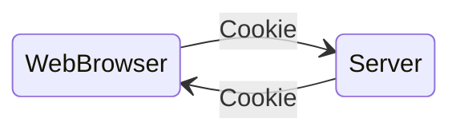

**Cookies - Contents**
+ Name / value pair

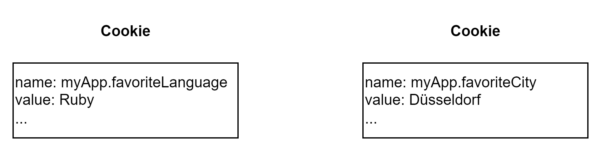  
+ Application can actually create many cookies, the max us about **20 cookies** per site path.

**How are Cookies passed?**
+ Browser will only send cookies that match the server's domain name.

### Cookie API

**Package**
+ **Cookie** class defined in package:**javax.servlet.http**
  + Package imported for free in all JSP pages


**Constructor**

**`Cookie(String name, String value)`**   
Construct a cookie with specified name and value

**Sending Cookies to Browser**

Code for sending cookies to a browser

```JSP
<%
   String favLang = request.getParameter("favoriteLanguage");
   
   // create cookie
   Cookie theCookie = new Cookie("nyApp.favoriteLanguage", favLang);
   
   // set life span ... total number of secounds
   theCookie.setMaxAge(60*60*24*365);
   
   // send cookie to browser
   reponse.addCookie(theCookie);
%>
```

+ Reading from form data `request.getParameter("favoriteLanguage")`
+ Create the cookie `new Cookie("nyApp.favoriteLanguage", favLang)` with name and value respectively
+ Set the life span of cookie`theCookie.setMaxAge()`, that cookie will expire on. By default life span is 0. To set the maxAge as the total number of seconds.
+ Send the cookie to browser `response.addCookie(theCookie)` by load it up into response object.


**Reading Cookies from the Browser**

```JSP
<!-- read the favorite programming language cookie -->
<%  
  String favLang = "Java";

  Cookie[] theCookies = request.getCookies();

  if (theCookies != null) {
    for (Cookies tempCookie : theCookies) {
      
      if ( "myApp.favoriteLanguage".equals(tempCookies.getName())) {
        faveLang = tempCookie.getValue();
        break;
      }
     
    }
  }
%>
```
+ To get a handle to the cookies, request object is used by `request.getCookies()` that will return the array of cookies.
+ Check the cookies that they are not equal to null
+ Loop all the cookies, until find the required cookie and break out the loop

**cookies-personalized-form.html**
```HTML
<!DOCTYPE html>
<html lang="en">
<head>
    <meta charset="UTF-8">
    <title>Personalized The Site</title>
</head>
<body>

<form action="cookies-personalized-response.jsp">
    Select your Favorite Programming Language
    <select name="favoriteLanguage">
        <option>Java</option>
        <option>C#</option>
        <option>PHP</option>
        <option>Ruby</option>
    </select>

    <br/><br/>

    <input type="submit" value="Submit" />

</form>
</body>
</html>
```


**cookies-personalize-response.jsp**
```JSP
<html>

<head>
    <title>Confirmation</title>
</head>

<%
    // read form data
    String favLang = request.getParameter("favoriteLanguage");

    // create the cookie
    Cookie theCookie = new Cookie("myApp.favoriteLanguage", favLang);

    // set the life span ... total number of seconds
    theCookie.setMaxAge(60 * 60 * 24 * 365); // <-- for one year

    // send cookies to browser
    response.addCookie(theCookie);
%>
<body>
    Thanks! We set your favorite language to: ${param.favoriteLanguage}

    <br/><br/>

    <a href="cookies-homepage.jsp">Return to homepage.</a>
</body>
</html>
```

**cookies-homepage.jsp**
```JSP
<html>

<body>
<h3>Training Portal</h3>

<! -- read the favorite programming language cookie
<%
    // the default ... if there are no cookies
    String favLang = "Java";

    // get the cookies from the browser request
    Cookie[] theCookies = request.getCookies();

    // find our favorite language cookie
    if (theCookies != null) {
        for (Cookie tempCookie : theCookies) {
            if ("myApp.favoriteLanguage".equals(tempCookie.getName())) {
                faveLang = tempCookie.getValue();
                break;
            }
        }
    }
%>

<!-- now show a personalized page ... use the "favLang variable -->

<!-- show new books for this lang -->
<h4>New Books for <%= favLang %></h4>
<ul>
    <li>blah blah blah</li>
    <li>blah blah blah</li>
</ul>

<h4>Latest News Reports for <%= favLang %></h4>
<ul>
    <li>blah blah blah</li>
    <li>blah blah blah</li>
</ul>

<h4>Hot Jobs for <%= favLang %></h4>
<ul>
    <li>blah blah blah</li>
    <li>blah blah blah</li>
</ul>
<a href="cookies-personalized-form.html">Personalize this page</a>
</body>
</html>
```
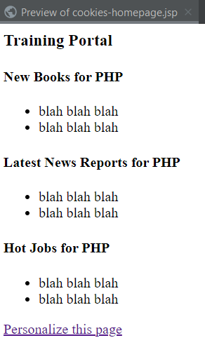
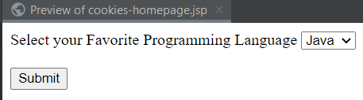
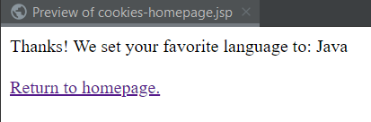
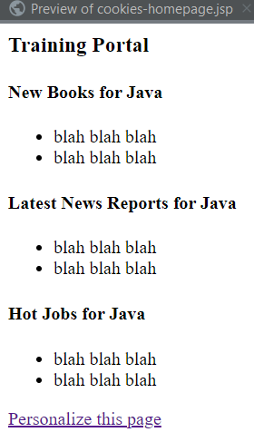
**Question: **

How to handle white-space in Cookie values?

\---


**Answer:**

To resolve this issue, we need to URL encode the cookie values.

Java provides two classes for URL encoding and decoding:  
java.net.URLEncoder, java.net.URLDecoder.

As an overview, these are the changes that need to be made.

In the file: **cookies-homepage.jsp**:  add code to URL decode the cookie value

```JSP
    // decode cookie data ... handle case of languages with spaces in them 
    favLang = URLDecoder.decode(tempCookie.getValue(), "UTF-8");
```

In the file: **cookies-personalize-response.jsp**: add code to URL encode the cookie value

```JSP
    // encode cookie data ... handle case of languages with spaces in them  
    favLang = URLEncoder.encode(favLang, "UTF-8");
```

Here is the complete code for this example. Make note of the import statements in the JSP pages.